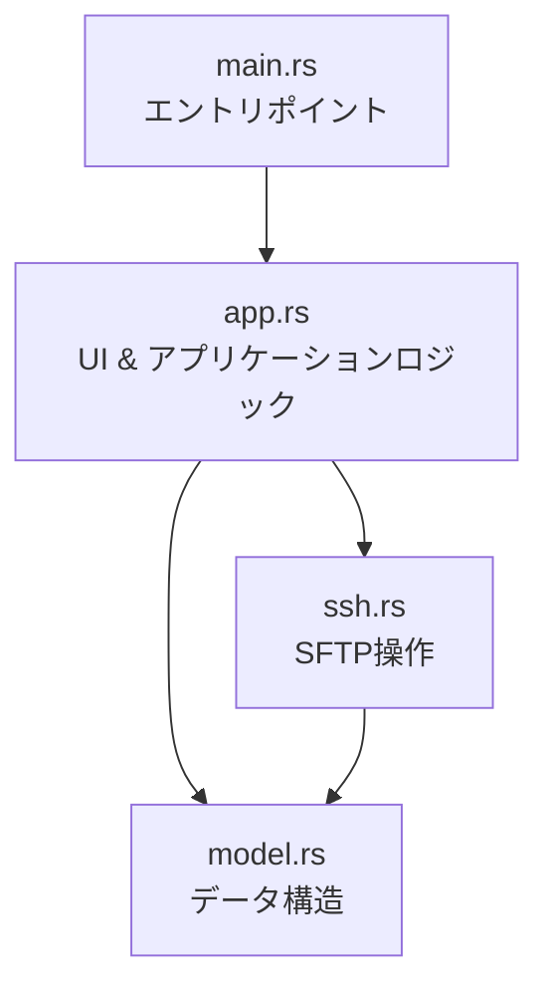
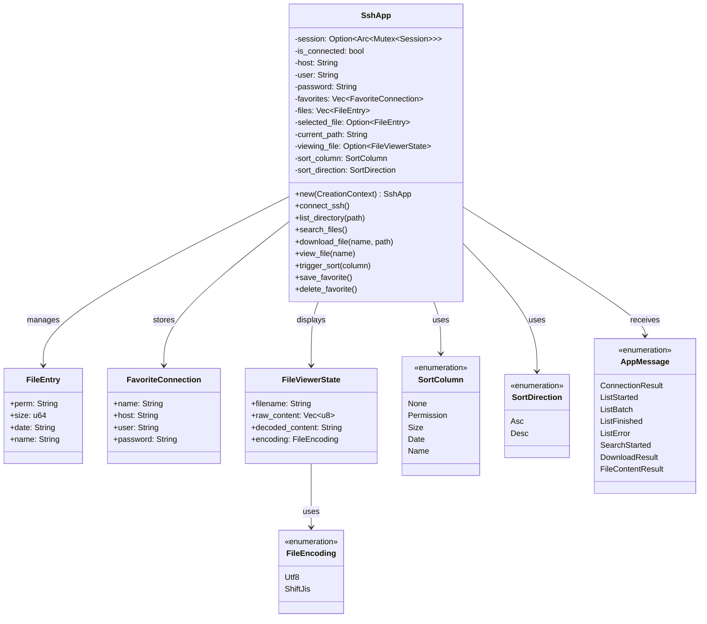
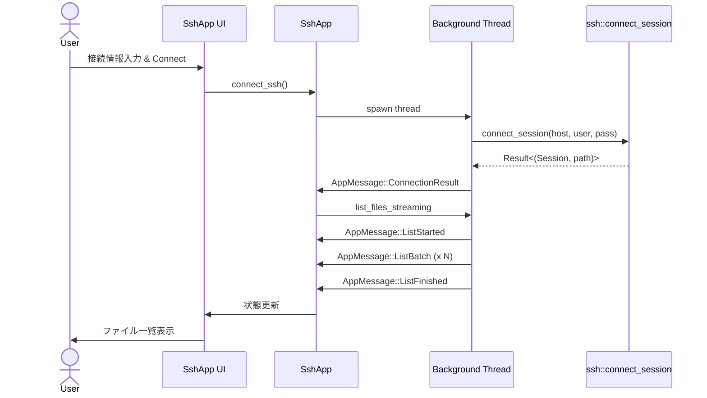
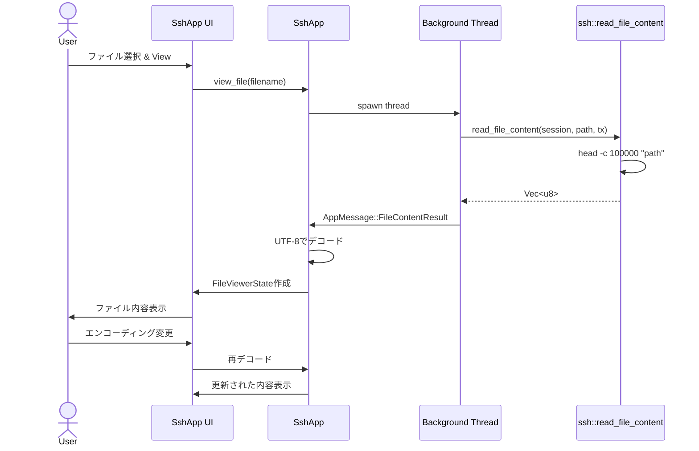
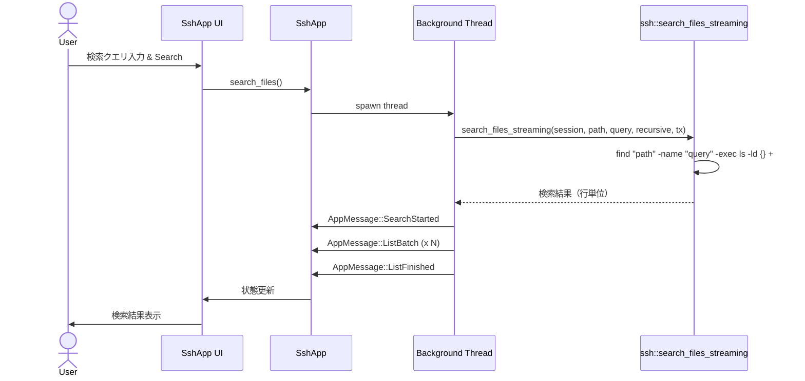
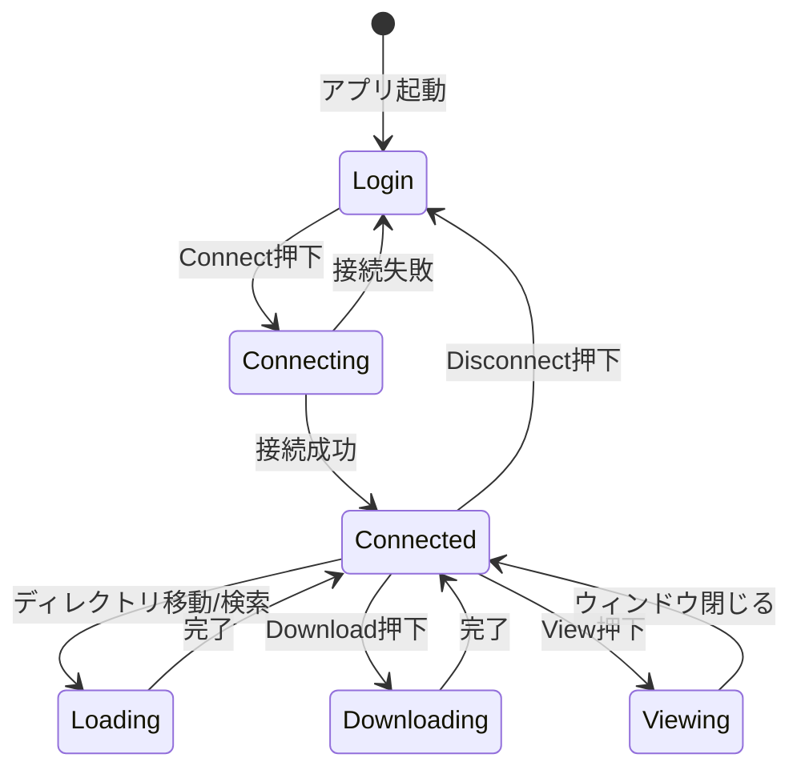

# SSH File Browser - 詳細設計書

## 1. システム概要

SSH File Browserは、Rustで実装されたGUIベースのSSHファイルブラウザです。リモートサーバーへSSH接続し、ファイルの閲覧、検索、ダウンロード、内容表示を行います。

### 主要機能
- SSH接続管理（お気に入り機能付き）
- リモートファイルのブラウジング（ディレクトリナビゲーション）
- ファイル検索（再帰的検索対応）
- ファイルのダウンロード（SCP）
- ファイル内容のプレビュー（エンコーディング選択可能）
- ソート機能（名前、サイズ、日付）

## 2. アーキテクチャ

### 2.1 モジュール構成



### 2.2 依存関係

- **eframe/egui**: GUIフレームワーク
- **ssh2**: SSH/SFTP/SCPプロトコル実装
- **encoding_rs**: 文字エンコーディング変換
- **serde/serde_json**: お気に入り設定の永続化
- **rfd**: ファイルダイアログ
- **chrono**: タイムスタンプ変換
- **regex**: パターンマッチング

## 3. クラス図



## 4. シーケンス図

### 4.1 SSH接続フロー



### 4.2 ファイル表示フロー



### 4.3 ファイル検索フロー



## 5. 状態遷移図



## 6. データフロー

### 6.1 メッセージング

アプリケーションは非同期処理のために`mpsc::channel`を使用します：

```
Background Thread → Sender → Channel → Receiver → SshApp::update()
```

**メッセージタイプ**:
- `ConnectionResult`: 接続結果
- `ListStarted`: ファイル一覧取得開始
- `ListBatch`: ファイルエントリのバッチ
- `ListFinished`: 一覧取得完了
- `ListError`: エラー発生
- `SearchStarted`: 検索開始
- `DownloadResult`: ダウンロード結果
- `FileContentResult`: ファイル内容取得結果

### 6.2 ファイル一覧の取得

```
ls -ltr -N "path" → BufReader → parse_line() → FileEntry → ListBatch → SshApp.files
```

## 7. 主要アルゴリズム

### 7.1 SFTP APIによるファイル一覧取得

```rust
// SFTP APIを使用してディレクトリ一覧を取得
pub fn list_files_streaming(sftp_arc: &Arc<Mutex<Sftp>>, path: &str, tx: mpsc::Sender<AppMessage>) -> anyhow::Result<()> {
    let sftp = sftp_arc.lock()?;
    let entries = sftp.readdir(Path::new(path))?;
    
    for (entry_path, stat) in entries {
        let file_entry = FileEntry {
            perm: format_permissions(&stat),  // パーミッションを文字列に変換
            size: stat.size.unwrap_or(0),
            date: format_timestamp(stat.mtime),  // Unixタイムスタンプを変換
            name: entry_path.file_name()?.to_str()?.to_string(),
        };
        // バッチ送信...
    }
}
```

### 7.2 ストリーミング処理

大量のファイルを効率的に処理するため、バッチ処理を実装：

```rust
let mut batch = Vec::new();
for line in reader.lines() {
    if let Some(entry) = parse_line(&line) {
        batch.push(entry);
        if batch.len() >= 200 {
            tx.send(AppMessage::ListBatch(batch));
            batch = Vec::new();
        }
    }
}
```

### 7.3 エンコーディング変換

```rust
// UTF-8またはShift-JISでデコード
let coder = match encoding {
    FileEncoding::Utf8 => encoding_rs::UTF_8,
    FileEncoding::ShiftJis => encoding_rs::SHIFT_JIS,
};
let (decoded, _, _) = coder.decode(&raw_content);
```

## 8. UI設計

### 8.1 ログイン画面

```
┌─────────────────────────────────────┐
│         SSH Login                   │
│                                     │
│  Favorites: [Select a favorite...▼]│
│                                     │
│  Host (IP:Port): [192.168.0.21:22] │
│  Username:       [taiki           ] │
│  Password:       [••••••••••••••••] │
│                                     │
│  Name: [        ] [Save as Favorite]│
│                   [Delete Favorite] │
│                                     │
│           [Connect]                 │
│                                     │
│  Status: Ready to connect.          │
└─────────────────────────────────────┘
```

### 8.2 ファイルブラウザ画面

```
┌─────────────────────────────────────────────────────┐
│ SSH File Browser              [Disconnect]          │
├─────────────────────────────────────────────────────┤
│ [⬆] Path: [/home/user/documents        ] [Go]      │
│ Search: [*.txt            ] ☑Recursive [Search]    │
│ Status: Listed 150 files.                           │
├─────────────────────────────────────────────────────┤
│ [Refresh] [View] [Download]                         │
├─────────────────────────────────────────────────────┤
│ Permissions│ Size  │ Date          │ Name           │
├────────────┼───────┼───────────────┼────────────────┤
│ drwxr-xr-x │  4096 │ Jan 01 12:00  │ folder1        │
│ -rw-r--r-- │  1234 │ Jan 02 13:30  │ file.txt       │
│ -rw-r--r-- │  5678 │ Jan 03 14:45  │ document.pdf   │
└─────────────────────────────────────────────────────┘
```

### 8.3 ファイルビューア

```
┌─────────────────────────────────────┐
│ Viewing: file.txt            [X]    │
├─────────────────────────────────────┤
│ Encoding: [UTF-8        ▼]          │
├─────────────────────────────────────┤
│ ┌─────────────────────────────────┐ │
│ │ File content here...            │ │
│ │ 日本語のテキスト                │ │
│ │ More content...                 │ │
│ │                                 │ │
│ │                                 │ │
│ └─────────────────────────────────┘ │
└─────────────────────────────────────┘
```

## 9. エラーハンドリング

### 9.1 接続エラー

- TCP接続失敗
- SSH認証失敗
- セッションタイムアウト

→ ステータスメッセージに表示、ログイン画面に戻る

### 9.2 ファイル操作エラー

- ファイルが存在しない
- 権限エラー
- ネットワークエラー

→ ステータスメッセージに表示、操作を中断

### 9.3 パースエラー

- 予期しないls出力形式

→ エントリをスキップ、処理継続

## 10. パフォーマンス最適化

### 10.1 大量ファイル対応

- **ストリーミング処理**: 200件ごとにバッチ送信
- **UI仮想化**: `egui::TableBuilder::rows()`で表示行のみレンダリング
- **ファイルサイズ制限**: プレビューは先頭100KBのみ

### 10.2 UI応答性

- **非同期処理**: SSH操作は別スレッドで実行
- **ローディング表示**: `is_loading`フラグでスピナー表示
- **段階的更新**: `ListBatch`で部分的にUI更新

## 11. セキュリティ考慮事項

> [!WARNING]
> **パスワード保存**: お気に入り機能でパスワードを平文で`favorites.json`に保存しています。本番環境では暗号化または除外を推奨します。

> [!NOTE]
> **Command Injection対策完了**: SFTP APIの使用により、コマンド実行を完全に排除しました。
> - ディレクトリ一覧: `sftp.readdir()` - コマンド不要
> - ファイル検索: Rust側でパターンマッチング - コマンド不要  
> - ファイル読み取り: `sftp.open()` - コマンド不要
> - 初期パス取得: `sftp.realpath()` - pwdコマンド不要

### セキュリティ改善点

1. **コマンドインジェクション**: SFTP APIにより完全に排除
2. **パス検証**: SFTP APIが自動的にパスを検証
3. **エスケープ処理**: 不要（コマンド実行なし）

## 12. 今後の拡張案

- [ ] SFTP対応
- [ ] ファイルアップロード機能
- [ ] ファイル編集機能
- [ ] 複数接続のタブ管理
- [ ] キーボードショートカット
- [ ] ブックマーク機能
- [ ] ファイル権限の変更
- [ ] シンボリックリンク対応
